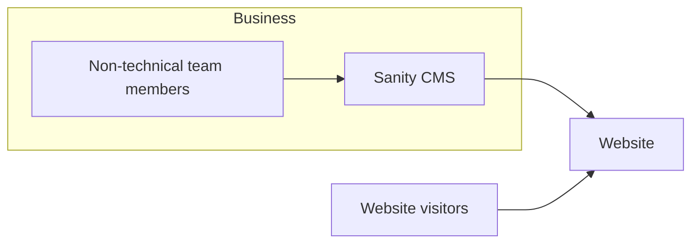
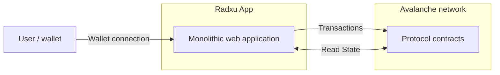

import { CardGrid, LinkCard } from "@astrojs/starlight/components";
import ImageLightbox from "../../../components/ImageLightbox.astro";
import audicityDesktop1 from "../../../assets/Audicity Desktop 1.png";
import audicityDesktop2 from "../../../assets/Audicity Desktop 2.png";
import audicityDesktop3 from "../../../assets/Audicity Desktop 3.png";
import audicityDesktop4 from "../../../assets/Audicity Desktop 4.png";
import audicityDesktop5 from "../../../assets/Audicity Desktop 5.png";
import audicityDesktop6 from "../../../assets/Audicity Desktop 6.png";
import audicityDesktop7 from "../../../assets/Audicity Desktop 7.png";
import audicityDesktop8 from "../../../assets/Audicity Desktop 8.png";
import audicityDesktop9 from "../../../assets/Audicity Desktop 9.png";
import audicityDesktop10 from "../../../assets/Audicity Desktop 10.png";
import audicityDesktop11 from "../../../assets/Audicity Desktop 11.png";
import audicityMobile1 from "../../../assets/Audicity mobile 1.png";
import audicityMobile2 from "../../../assets/Audicity mobile 2.png";
import audicityMobile3 from "../../../assets/Audicity mobile 3.png";
import audicityMobile4 from "../../../assets/Audicity mobile 4.png";
import audicityMobile5 from "../../../assets/Audicity mobile 5.png";
import audicityMobile6 from "../../../assets/Audicity mobile 6.png";
import audicityMobile7 from "../../../assets/Audicity mobile 7.png";
import audicityMobile8 from "../../../assets/Audicity mobile 8.png";
import audicityMobile9 from "../../../assets/Audicity mobile 9.png";
import audicityMobile10 from "../../../assets/Audicity mobile 10.png";
import audicityMobile11 from "../../../assets/Audicity mobile 11.png";
import radxuAppDesktop1 from "../../../assets/Radxu App desktop 1.png";
import radxuAppDesktop2 from "../../../assets/Radxu App desktop 2.png";
import radxuAppDesktop3 from "../../../assets/Radxu App desktop 3.png";
import radxuAppDesktop4 from "../../../assets/Radxu App desktop 4.png";
import radxuAppDesktop5 from "../../../assets/Radxu App desktop 5.png";
import radxuAppDesktop6 from "../../../assets/Radxu App desktop 6.png";
import radxuAppDesktop7 from "../../../assets/Radxu App desktop 7.png";
import radxuAppDesktop8 from "../../../assets/Radxu App desktop 8.png";
import radxuAppDesktop9 from "../../../assets/Radxu App desktop 9.png";
import radxuAppMobile1 from "../../../assets/Radxu App mobile 1.png";
import radxuAppMobile2 from "../../../assets/Radxu App mobile 2.png";
import radxuAppMobile3 from "../../../assets/Radxu App mobile 3.png";
import radxuAppMobile4 from "../../../assets/Radxu App mobile 4.png";
import radxuAppMobile5 from "../../../assets/Radxu App mobile 5.png";
import radxuAppMobile6 from "../../../assets/Radxu App mobile 6.png";
import radxuAppMobile7 from "../../../assets/Radxu App mobile 7.png";
import radxuAppMobile8 from "../../../assets/Radxu App mobile 8.png";
import radxuAppMobile9 from "../../../assets/Radxu App mobile 9.png";
import radxuAppMobile10 from "../../../assets/Radxu App mobile 10.png";
import radxuAppMobile11 from "../../../assets/Radxu App mobile 11.png";
import radxuAppMobile12 from "../../../assets/Radxu App mobile 12.png";
import radxuAppMobile13 from "../../../assets/Radxu App mobile 13.png";
import radxuAppMobile14 from "../../../assets/Radxu App mobile 14.png";
import radxuLandingDesktop1 from "../../../assets/Radxu Landing desktop 1.png";
import radxuLandingDesktop2 from "../../../assets/Radxu Landing desktop 2.png";
import radxuLandingDesktop3 from "../../../assets/Radxu Landing desktop 3.png";
import radxuLandingDesktop4 from "../../../assets/Radxu Landing desktop 4.png";
import radxuLandingDesktop5 from "../../../assets/Radxu Landing desktop 5.png";
import radxuLandingDesktop6 from "../../../assets/Radxu Landing desktop 6.png";
import radxuLandingDesktop7 from "../../../assets/Radxu Landing desktop 7.png";
import radxuLandingDesktop8 from "../../../assets/Radxu Landing desktop 8.png";
import radxuLandingDesktop9 from "../../../assets/Radxu Landing desktop 9.png";
import radxuLandingDesktop10 from "../../../assets/Radxu Landing desktop 10.png";
import radxuLandingDesktop11 from "../../../assets/Radxu Landing desktop 11.png";
import radxuLandingDesktop12 from "../../../assets/Radxu Landing desktop 12.png";
import radxuLandingDesktop13 from "../../../assets/Radxu Landing desktop 13.png";
import radxuLandingDesktop14 from "../../../assets/Radxu Landing desktop 14.png";
import radxuLandingDesktop15 from "../../../assets/Radxu Landing desktop 15.png";
import radxuLandingDesktop16 from "../../../assets/Radxu Landing desktop 16.png";
import radxuLandingMobile1 from "../../../assets/Radxu Landing mobile 1.png";
import radxuLandingMobile2 from "../../../assets/Radxu Landing mobile 2.png";
import radxuLandingMobile3 from "../../../assets/Radxu Landing mobile 3.png";
import radxuLandingMobile4 from "../../../assets/Radxu Landing mobile 4.png";
import radxuLandingMobile5 from "../../../assets/Radxu Landing mobile 5.png";
import radxuLandingMobile6 from "../../../assets/Radxu Landing mobile 6.png";
import radxuLandingMobile7 from "../../../assets/Radxu Landing mobile 7.png";
import radxuLandingMobile8 from "../../../assets/Radxu Landing mobile 8.png";
import radxuLandingMobile9 from "../../../assets/Radxu Landing mobile 9.png";
import radxuLandingMobile10 from "../../../assets/Radxu Landing mobile 10.png";
import radxuLandingMobile11 from "../../../assets/Radxu Landing mobile 11.png";
import radxuLandingMobile12 from "../../../assets/Radxu Landing mobile 12.png";
import radxuLandingMobile13 from "../../../assets/Radxu Landing mobile 13.png";
import radxuLandingMobile14 from "../../../assets/Radxu Landing mobile 14.png";
import radxuLandingMobile15 from "../../../assets/Radxu Landing mobile 15.png";
import radxuLandingMobile16 from "../../../assets/Radxu Landing mobile 16.png";
import radxuLandingMobile17 from "../../../assets/Radxu Landing mobile 17.png";

Audicity was a Web3 software development company focused on helping traditional Web2 businesses explore blockchain integrations. Its services included building custom blockchain infrastructure, such as smart contracts, NFT launches, and cryptocurrency payment integrations for external clients.

Radxu was the first project developed within the Audicity ecosystem and was built on the Avalanche network. It was structured as a community-driven foundation designed to fund the development of Web3 products. The platform offered several financial products: two mechanisms intended to help bootstrap and sustain the Radxu ecosystem itself, and a third product (CSAs) designed to fund external projects.

In practice, the project ultimately failed to deliver the expected products or financial returns to its community. As a result, Radxu was discontinued, and many participants incurred significant losses.

## Technology Stack

### Blockchain / Smart Contracts

- Avalanche
- Solidity
- Foundry
- Hardhat
- OpenZeppelin

### Frontend

- Next.js
- React
- TypeScript
- TailwindCSS
- DaisyUI
- Wagmi
- Viem
- Custom state management library

### Backend & Services

- Sanity (content management)
- Sentry (error tracking)

### Infrastructure & DevOps

- Vercel
- GitHub
- GitHub Actions (CI/CD)

## System Architecture

### Architecture Approach

Given the small team and limited resources, the system architecture was deliberately simple, prioritizing rapid delivery while keeping the codebase maintainable for a two developer team.

One developer focused primarily on smart contract development, while I was responsible for the web platform and user-facing systems.

### Web Platforms

The Audicity and Radxu landing pages were implemented as static web applications connected to a headless CMS. This allowed the CEO and non-technical team members to update website content and manage blog posts without requiring developer support.

Sanity was integrated as the CMS to manage all website content, including marketing pages and blog entries.



### Radxu Application

The Radxu application followed a simple monolithic architecture. The frontend interacted directly with the smart contracts deployed on the Avalanche network without relying on external APIs or indexing layers.

This approach minimized infrastructure complexity and allowed the team to focus on building the core product features as quickly as possible.



---

## My Contributions

### Landing Pages & CMS Integration

I was responsible for the development of the company websites. Using Figma designs provided by an external agency, I implemented the landing pages for Audicity and Radxu. I integrated Sanity CMS to allow non-technical team members to update content and manage the blog independently, without requiring developer support.

### Application Development

I developed the Radxu application as a simplified monolithic web app, prioritizing rapid delivery given the small team and limited resources. This included implementing features such as the CSA interface and staking functionality, which were completed but never launched due to the company's funding constraints.

### Project Handoff

Before leaving the company, I ensured that all frontend work was fully implemented and deployment-ready, enabling the project to continue immediately if additional funding had been secured.

## Supporting Material

### Audicity

<div className="w-full mb-6">
  <span class="text-secondary font-semibold leading-snug block mb-4">
    Lading - May 22, 2023
  </span>
  <div class="grid gap-4 grid-cols-[repeat(auto-fit,minmax(min(100%,300px),1fr))] m-0">
    {[
      audicityDesktop1,
      audicityDesktop2,
      audicityDesktop3,
      audicityDesktop4,
      audicityDesktop5,
      audicityDesktop6,
      audicityDesktop7,
      audicityDesktop8,
      audicityDesktop9,
      audicityDesktop10,
      audicityDesktop11,
    ].map((img, i) => (
      <ImageLightbox
        src={img.src}
        alt={`Audicity Desktop ${i + 1}`}
        class={i > 0 ? "m-0" : undefined}
      />
    ))}
  </div>
  <div class="grid gap-4 grid-cols-[repeat(auto-fit,minmax(min(100%,150px),1fr))] m-0 mt-6">
    {[
      audicityMobile1,
      audicityMobile2,
      audicityMobile3,
      audicityMobile4,
      audicityMobile5,
      audicityMobile6,
      audicityMobile7,
      audicityMobile8,
      audicityMobile9,
      audicityMobile10,
      audicityMobile11,
    ].map((img, i) => (
      <ImageLightbox
        src={img.src}
        alt={`Audicity Mobile ${i + 1}`}
        class={i > 0 ? "m-0" : undefined}
      />
    ))}
  </div>
</div>

<CardGrid>
  <LinkCard
    href="https://audicity.io/"
    title="Website"
    description="audicity.io"
    target="_blank"
  />
  <LinkCard
    href="https://x.com/audicity_io"
    title="Social"
    description="x.com/audicity_io"
    target="_blank"
  />
</CardGrid>

### Radxu

<div className="w-full mb-6">
  <span class="text-secondary font-semibold leading-snug block mb-4">
    dApp - May 22, 2023
  </span>
  <div class="grid gap-4 grid-cols-[repeat(auto-fit,minmax(min(100%,300px),1fr))] m-0">
    {[
      radxuAppDesktop1,
      radxuAppDesktop2,
      radxuAppDesktop3,
      radxuAppDesktop4,
      radxuAppDesktop5,
      radxuAppDesktop6,
      radxuAppDesktop7,
      radxuAppDesktop8,
      radxuAppDesktop9,
    ].map((img, i) => (
      <ImageLightbox
        src={img.src}
        alt={`Radxu dApp Desktop ${i + 1}`}
        class={i > 0 ? "m-0" : undefined}
      />
    ))}
  </div>
  <div class="grid gap-4 grid-cols-[repeat(auto-fit,minmax(min(100%,150px),1fr))] m-0 mt-6">
    {[
      radxuAppMobile1,
      radxuAppMobile2,
      radxuAppMobile3,
      radxuAppMobile4,
      radxuAppMobile5,
      radxuAppMobile6,
      radxuAppMobile7,
      radxuAppMobile8,
      radxuAppMobile9,
      radxuAppMobile10,
      radxuAppMobile11,
      radxuAppMobile12,
      radxuAppMobile13,
      radxuAppMobile14,
    ].map((img, i) => (
      <ImageLightbox
        src={img.src}
        alt={`Radxu dApp Mobile ${i + 1}`}
        class={i > 0 ? "m-0" : undefined}
      />
    ))}
  </div>
  <hr class="border-t border-neutral-dark my-8" />
  <span class="text-secondary font-semibold leading-snug block mb-4">
    Landing - May 22, 2023
  </span>
  <div class="grid gap-4 grid-cols-[repeat(auto-fit,minmax(min(100%,300px),1fr))] m-0">
    {[
      radxuLandingDesktop1,
      radxuLandingDesktop2,
      radxuLandingDesktop3,
      radxuLandingDesktop4,
      radxuLandingDesktop5,
      radxuLandingDesktop6,
      radxuLandingDesktop7,
      radxuLandingDesktop8,
      radxuLandingDesktop9,
      radxuLandingDesktop10,
      radxuLandingDesktop11,
      radxuLandingDesktop12,
      radxuLandingDesktop13,
      radxuLandingDesktop14,
      radxuLandingDesktop15,
      radxuLandingDesktop16,
    ].map((img, i) => (
      <ImageLightbox
        src={img.src}
        alt={`Radxu Landing Desktop ${i + 1}`}
        class={i > 0 ? "m-0" : undefined}
      />
    ))}
  </div>
  <div class="grid gap-4 grid-cols-[repeat(auto-fit,minmax(min(100%,150px),1fr))] m-0 mt-6">
    {[
      radxuLandingMobile1,
      radxuLandingMobile2,
      radxuLandingMobile3,
      radxuLandingMobile4,
      radxuLandingMobile5,
      radxuLandingMobile6,
      radxuLandingMobile7,
      radxuLandingMobile8,
      radxuLandingMobile9,
      radxuLandingMobile10,
      radxuLandingMobile11,
      radxuLandingMobile12,
      radxuLandingMobile13,
      radxuLandingMobile14,
      radxuLandingMobile15,
      radxuLandingMobile16,
      radxuLandingMobile17,
    ].map((img, i) => (
      <ImageLightbox
        src={img.src}
        alt={`Radxu Landing Mobile ${i + 1}`}
        class={i > 0 ? "m-0" : undefined}
      />
    ))}
  </div>
</div>

<CardGrid>
  <LinkCard
    href="https://www.radxu.org/"
    title="Website"
    description="www.radxu.org"
    target="_blank"
  />
  <LinkCard
    href="https://app.radxu.org/"
    title="Application"
    description="app.radxu.org"
    target="_blank"
  />
  <LinkCard
    href="https://x.com/RadxuFoundation"
    title="Social"
    description="x.com/RadxuFoundation"
    target="_blank"
  />
</CardGrid>
```
