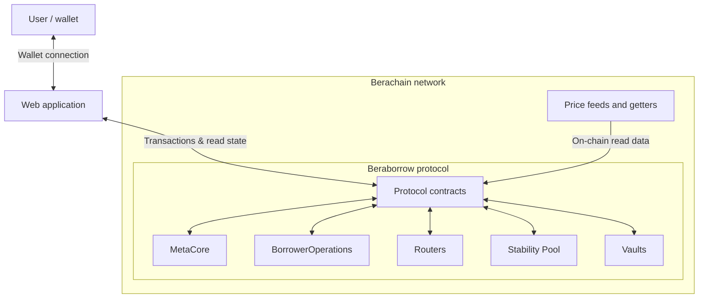
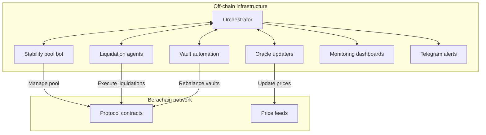
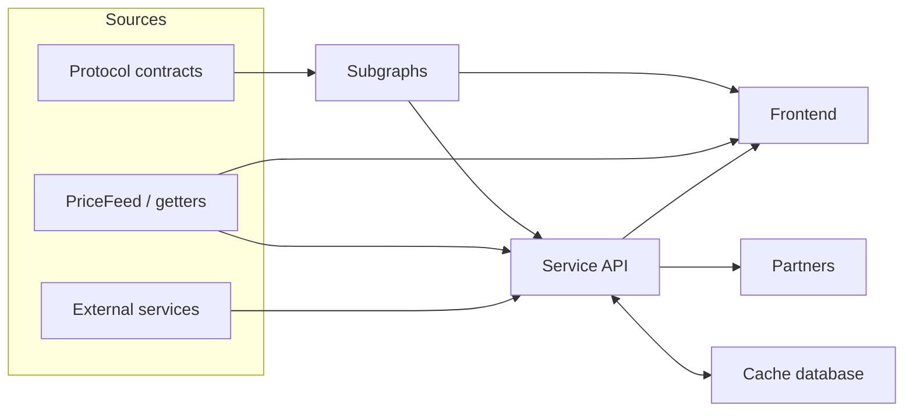

import { ShowcaseImage, ShowcaseYouTube } from "starlight-showcases";
import { CardGrid, LinkCard } from "@astrojs/starlight/components";
import yarifiBrand from "../../../assets/yarifi-brand.png";

Beraborrow is a DeFi lending protocol built within the Berachain ecosystem, designed around over-collateralized borrowing and stability pool mechanics. Users deposit collateral to mint a native stablecoin, interacting with liquidation mechanisms, incentive structures, and on-chain financial logic.

The system combines smart contracts, frontend applications, data indexing layers, and off-chain automation to coordinate borrowing, redemptions, liquidations, and yield distribution. Its architecture balances capital efficiency with protocol safety, requiring careful handling of state, pricing data, and user interactions.

As the protocol expanded, the same core market architecture was deployed as YariFi on Katana, introducing the need for structural standardization, multi-environment adaptability, and improved indexing and automation to support scalable growth.

## Technology Stack

### Blockchain / Smart Contracts

- Berachain and Katana
- Solidity
- Hardhat
- Foundry
- OpenZeppelin

### Frontend

- Next.js
- React
- TypeScript
- TanStack
- React Query
- Material UI (MUI) and Sass
- Framer
- Viem and Wagmi (for contract interactions)
- Jotai (state management)
- AppKit
- Recharts
- Custom business logic SDK

### Backend / API Layer

- Nest.js
- TypeScript
- GraphQL
- Swagger
- Redis
- Service API for data processing, caching, and frontend consumption
- API for scheduling bot scripts

### Data & Indexing

- The Graph (subgraph)
- Goldsky (subgraphs)

### Infrastructure & DevOps

- AWS
- Cloudflare
- GitHub
- GitHub Actions (CI/CD)

## System Architecture

### Protocol

Beraborrow is a highly modular lending protocol that combines complex on-chain smart contracts with off-chain automation services responsible for maintaining protocol health and executing operational tasks.

The system consists of two main layers: on-chain protocol infrastructure and off-chain automation services.

#### On-chain

The protocol relies on a modular smart contract architecture deployed on the Berachain network, where each contract handles a specific responsibility within the lending system.

- **MetaCore**: Central protocol logic and state management.
- **BorrowerOperations**: Handles borrowing, repayment, and collateral management for user positions.
- **Leverage & Deleverage Routers**: Enable leveraged positions and automated risk adjustments.
- **PositionManagerGetters**: Provides read-only access to position and vault data.
- **Price Feeds**: Oracles to fetch collateral prices.
- **Stability Pool**: Ensures protocol stability by absorbing liquidations.
- **CollateralVaultRouter**: Manages collateral routing across vaults.
- **CollateralVaultRegistry**: Manages supported collateral types and vault configurations.
- **WrappedPositionManagers & CollateralVaultRegistry**: Manage multi-collateral support and wrapped assets.
- **Vaults**: Auto-Compounding (reinvest PoL yield), Managed Leverage (fixed leverage + NECT yield), and Dynamic Leverage (collateral in Kodiak v3 pools).

#### Off-chain

While the core financial logic runs on-chain, the protocol relies on several off-chain automation services that monitor the system and execute operational tasks that cannot be efficiently handled entirely on-chain.

- **Oracle Updaters**: Monitor external market data and update on-chain price feeds with validation safeguards.
- **Stability Pool Bots**: Monitor the stability pool and adjust deposits and absorbed debt to maintain balanced conditions.
- **Liquidation Agents**: Continuously scan borrower positions and trigger liquidations when collateral ratios become unsafe.
- **Vault Automation**: Compound yield, rebalance vault strategies, and reduce liquidation risk.
- **Orchestration & Monitoring**: Coordinate the automation layer through RPC failover handling, wallet fallbacks, monitoring dashboards, and Telegram notifications.

### Data Layer

The protocol includes a dedicated data layer that exposes protocol state efficiently to frontend applications and external partners.

Direct blockchain queries are not practical for complex interfaces, so the system combines indexed blockchain data, a service API, caching, and external integrations to aggregate and standardize information before it reaches client applications.

- **Indexing Layer**: Subgraphs index protocol activity such as positions, collateral deposits, borrowing activity, liquidations, and vaults state. These subgraphs enabling efficient querying of historical and real-time protocol data.
- **Service API**: Combines indexed blockchain data, external services, and protocol-specific business logic. The API exposes standardized and also provides endpoints used by partner integrations.
- **Caching Layer**: Used to reduce latency and avoid repeated indexing queries by caching frequently requested data, including protocol statistics, market data, vault metrics, and results of computationally expensive logic.
- **External Services**: The API integrates external services and exposes endpoints that allow partners to read protocol information and interact with protocol data in a structured way.
- **Protocol SDK**: A custom SDK encapsulates the core protocol logic required to compute and structure application data correctly. It provides reusable functions for retrieving, transforming, and operating on protocol data in a consistent way.

### White-label

As the protocol expanded, we introduced a white-label architecture that allowed the same core system to be deployed across different environments and brands while maximizing code reuse.

YariFi became the first deployment of this architecture, running on Katana while reusing most of the infrastructure originally built for Beraborrow on Berachain. Although both deployments share the same architectural foundations, each brand adapts specific protocol parameters, integrations, and infrastructure components to match its target ecosystem.

- **Smart Contracts**: Contracts are deployed separately for each brand. While they share the same foundations, each deployment can introduce updated versions, adjusted collateral parameters, simplified mechanics, different addresses, and its own upgrade path. YariFi, for example, runs a lighter version of the protocol adapted to the Katana ecosystem.
- **Subgraphs**: Indexing is adapted through a templating system. A script generates brand-specific constants, while `subgraph.template.yaml` uses Mustache conditionals to produce the final configuration for each deployment.
- **Service API**: The API uses a brand modularization system. A dedicated `brands` directory contains brand-specific logic, partner integrations, and environment-specific behavior, while the rest of the API remains shared.
- **Protocol SDK**: The SDK includes brand configuration files and feature flags. During the build process, it loads the configuration for the target brand so the same codebase can support multiple protocol deployments.
- **Frontend**: The frontend uses theming and configuration layers, including reusable components, feature flags, environment settings, and brand-specific visual identity, allowing the same codebase to adapt to different brands while preserving a consistent architecture.

## My Contributions

### Frontend Stabilization & Wallet Integrations

I started by addressing a series of frontend issues reported by QA, with a particular focus on wallet integration problems around AppKit. To resolve them, I opened multiple discussions and pull requests upstream, which eventually led to direct collaboration with Reown team and the creation of a direct channel between both teams to address the most critical user-facing wallet issues more efficiently.

### Product Features & User Flows

I contributed to key product flows by developing features that reduce friction and improve the user experience:

- **Zaps & Stability Pool**: Enabled users to provide NECT and deposit into the auto-compounding sNECT vault in a single transaction. Redesigned the Stability Pool page for clarity and usability.
- **Swap Flows**: Implemented collateral and LP token swaps through Enso, simplifying asset management across the app.
- **Governance & Staking**: Built components for the staking page during the launch of the governance token Pollen, ensuring seamless participation.
- **Leverage & Unwind (Dens)**: Iterated on SDK logic and refined the UX based on user feedback, delivering an intuitive experience for opening and closing leveraged positions.

### Frontend Architecture, State Management & Performance

I enhanced the frontend architecture and improved key application patterns to increase reliability and user experience:

- **State Management (Jotai)**: Corrected the use of `atomsWithQuery` across the app, resolving data synchronization issues that previously required users to refresh for accurate information.
- **Modals & Transactions**: Standardized the sequential flow system, ensuring user actions remain synchronized with necessary data updates.
- **Code Abstraction & Maintainability**: Removed duplicated logic and introduced reusable abstractions, reducing errors and making the codebase easier to maintain.
- **Performance Optimization**: Improved atom loading and memory usage, cutting unnecessary renders, duplicated data fetching, and network overhead, which enhanced app responsiveness and overall UX.

### API, Integrations & Backend Technical Debt

I improved the API architecture, integrations, and reliability to simplify development and reduce technical debt:

- **Documentation & Standardization**: Documented endpoints with Swagger, improving clarity for the team and partners.
- **DEX Aggregator Router**: Built a unified router for Enso, OogaBooga, and newly added SushiSwap, simplifying internal logic and making the API more maintainable.
- **Progressive Migration**: Maintained the old aggregator implementation in parallel to enable a smooth, gradual transition to the new router without disrupting ongoing operations.
- **Data & Error Handling Improvements**: Introduced sanitizers, consistent response structures, and robust error handling to reduce failures and improve reliability.

### White-Label Architecture & YariFi

I contributed to the migration and adaptation of the protocol to the new YariFi deployment, ensuring scalable white-label support and consistent performance across brands:

- **API Refactoring & Brand Isolation**: Led the restructuring of the service API to maximize code reuse across brands while isolating brand-specific logic, enabling rapid deployment of new brands without duplicating core functionality.
- **Frontend Review & State Management**: Reviewed the frontend white-label implementation, ensuring Jotai atom structures remained correct, well-documented, and performant across multiple deployments.
- **Subgraph Adaptation & Event Handling**: Adapted subgraphs for the YariFi brand, resolving legacy issues and updating event handlers to rely solely on on-chain events, since contract call handlers used in Berachain no longer worked correctly in Katana.

### Off-chain Automation & Bots

I contribute to the automation layer, enhancing reliability, monitoring, and multi-DEX support:

- **DEX Aggregator Integration**: Add SushiSwap support to the automation bots and implement a unified DEX aggregator router, keeping the previous implementation running to enable a progressive migration and minimize rollout risk.
- **Monitoring & Notifications**: Improve Telegram notifications with standardized templates and classifications for expected errors, unexpected errors, critical failures, and successful processes, enhancing observability and operational clarity.
- **Collect-Interest and Stability Pool Rebalance Bots**: Rewrite the collect-interest and stability pool rebalance bots, integrating the new router, the updated Telegram reporting format, the standardization improvements agreed by the team, and additional documentation to support long-term maintenance.

## Supporting Material

### Beraborrow

<ShowcaseYouTube
  entries={[
    {
      href: "https://youtu.be/eNl6uaZppjg",
      title: "Beraborrow dApp at 23 of February 2026",
    },
  ]}
/>

<CardGrid>
  <LinkCard
    href="https://www.beraborrow.com"
    title="Website"
    description="www.beraborrow.com"
    target="_blank"
  />
  <LinkCard
    href="https://app.beraborrow.com"
    title="Application"
    description="app.beraborrow.com"
    target="_blank"
  />
  <LinkCard
    href="https://beraborrow.gitbook.io/docs"
    title="Documentation"
    description="beraborrow.gitbook.io/docs"
    target="_blank"
  />
  <LinkCard
    href="https://x.com/beraborrow"
    title="Social"
    description="x.com/beraborrow"
    target="_blank"
  />
</CardGrid>

### YariFi

  

    

      
    

    

      
        23 of February 2026
      
    

  

<CardGrid>
  <LinkCard
    href="https://beta.yari.fi"
    title="Beta Application"
    description="beta.yari.fi"
    target="_blank"
  />
  <LinkCard
    href="https://yarifi.gitbook.io/docs"
    title="Documentation"
    description="yarifi.gitbook.io/docs"
    target="_blank"
  />
  <LinkCard
    href="https://x.com/yarifinance"
    title="Social"
    description="x.com/yarifinance"
    target="_blank"
  />
</CardGrid>
