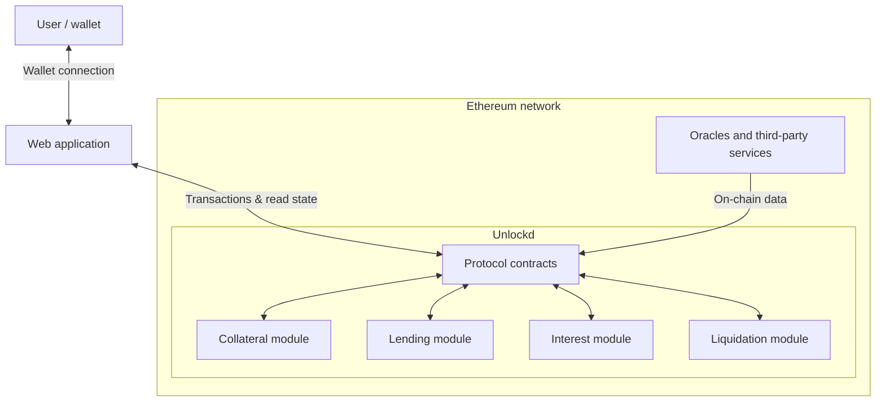
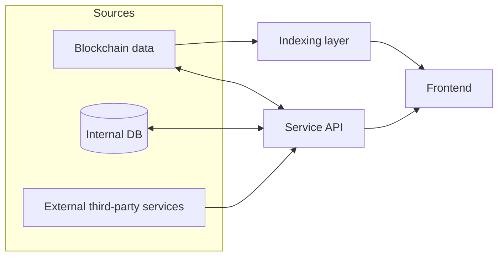
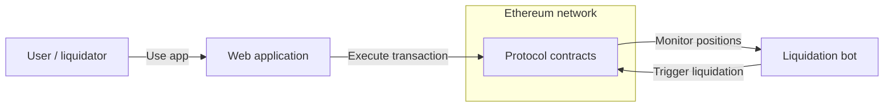
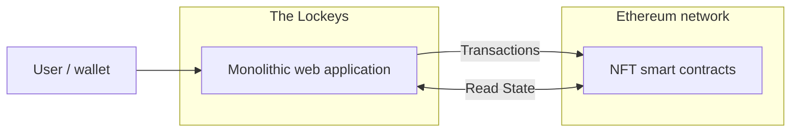

import { CardGrid, LinkCard } from "@astrojs/starlight/components";
import ImageLightbox from "../../../components/ImageLightbox.astro";
import unlockd1 from "../../../assets/Unlockd 1.png";
import unlockd2 from "../../../assets/Unlockd 2.png";
import unlockd3 from "../../../assets/Unlockd 3.png";
import unlockd4 from "../../../assets/Unlockd 4.png";
import unlockd5 from "../../../assets/Unlockd 5.png";
import unlockd6 from "../../../assets/Unlockd 6.png";
import lockeysDesktop1 from "../../../assets/The Lockeys desktop 1.png";
import lockeysDesktop2 from "../../../assets/The Lockeys desktop 2.png";
import lockeysDesktop3 from "../../../assets/The Lockeys desktop 3.png";
import lockeysDesktop4 from "../../../assets/The Lockeys desktop 4.png";
import lockeysDesktop5 from "../../../assets/The Lockeys desktop 5.png";
import lockeysDesktop6 from "../../../assets/The Lockeys desktop 6.png";
import lockeysDesktop7 from "../../../assets/The Lockeys desktop 7.png";
import lockeysDesktop8 from "../../../assets/The Lockeys desktop 8.png";
import lockeysMobile1 from "../../../assets/The Lockeys mobile 1.png";
import lockeysMobile2 from "../../../assets/The Lockeys mobile 2.png";
import lockeysMobile3 from "../../../assets/The Lockeys mobile 3.png";
import lockeysMobile4 from "../../../assets/The Lockeys mobile 4.png";
import lockeysMobile5 from "../../../assets/The Lockeys mobile 5.png";
import lockeysMobile6 from "../../../assets/The Lockeys mobile 6.png";
import lockeysMobile7 from "../../../assets/The Lockeys mobile 7.png";
import lockeysMobile8 from "../../../assets/The Lockeys mobile 8.png";

Unlockd was a collateralized lending protocol that allowed users to deposit NFTs as collateral and borrow tokens such as ETH or BTC. The key innovation of the protocol was its valuation system: instead of relying on the floor price of an NFT collection, it aimed to estimate the individual market value of each NFT used as collateral.

This approach allowed users to retain ownership of their NFTs and continue benefiting from their associated perks while accessing liquidity.

The protocol was built on the Ethereum network. It was successfully launched and operated for a period of time, but later suffered a hack that significantly damaged its reputation. As a result, the project was eventually discontinued.

The team behind the brand is currently pursuing a new direction focused on real estate tokenization. The Lockeys was an NFT collection launched within the Unlockd ecosystem—a collection of 3,500 pixel-art NFTs representing different roles within the protocol.

## Technology Stack

### Blockchain / Smart Contracts

- Ethereum
- Solidity
- Hardhat
- Foundry
- OpenZeppelin

### Frontend

- Next.js
- React
- TypeScript
- TailwindCSS
- Viem (The Lockeys)

### Frontend Architecture

- Custom state management library based on localStorage
- Internal error-handling library for frontend applications
- Internal wrapper library around ethers.js to standardize contract interactions

### Backend / API Layer

- Node.js
- Express
- TypeScript
- Prisma
- Service API for data processing, caching, and frontend consumption

### Data & Indexing

- The Graph (subgraph)
- MariaDB (database)
- MongoDB (database)
- HeidiSQL (database management)

### Infrastructure & DevOps

- AWS
- Vercel
- GitHub
- GitHub Actions (CI/CD)

## System Architecture

### Protocol

Unlockd followed a primarily on-chain architecture, where smart contracts handled the core protocol logic, including collateral management, loan issuance, interest accounting, and NFT liquidations.

Users interacted with the protocol through a web application connected to their wallets. The frontend executed transactions directly on-chain while presenting protocol state and user positions using indexed blockchain data.

### Data Layer

To support the frontend, the system included a service API responsible for processing and caching data. This API aggregated information from multiple sources, including indexed blockchain data, the internal database, and external services.

The frontend consumed data from both the API and the indexing layer to efficiently power dashboards, portfolio views, and protocol activity.

### Liquidation Mechanism

Liquidations were managed through a monitoring bot that continuously evaluated loan health and triggered liquidation transactions for unsafe positions.

In addition to the automated system, the protocol exposed a public liquidation interface that allowed any user to execute liquidations directly through the application.

### The Lockeys Platform

The Lockeys followed a simpler architecture. It was implemented as a monolithic web application that interacted directly with the smart contracts while reusing parts of the frontend infrastructure developed for Unlockd.

## My Contributions

### Technology & Architecture Selection

I participated in selecting the frontend and backend tools. As the team was relatively small and early in its experience building new platforms, I proposed bringing in an external senior frontend advisor to help validate the technology stack. Together, we defined the initial architecture for the web application and supporting services, ensuring rapid development while keeping the system maintainable for a small and young team.

### The Lockeys Development

Together with the UX/UI designer, I independently developed the initial version of The Lockeys, implementing the monolithic web application for NFT purchases. This work ran in parallel with early iterations of the Unlockd MVP, laying the foundation for both projects.

### Team Coordination & Product Design

As MVP requirements became clearer, I helped expand the frontend team by participating in hiring additional developers. I coordinated closely with the product designer to create Figma designs that matched available data and technical constraints. At the same time, I worked with the smart contract team to ensure proper integration with peripheral contracts, subgraphs, and partner APIs so that all necessary data was accessible.

### Frontend Architecture & Internal Tooling

I defined the frontend architecture and implemented internal libraries to standardize and simplify development, including:

- A custom state management library based on localStorage
- A reusable frontend error handling library
- A wrapper around ethers.js for standardized smart contract interactions

During this phase, the team used mock data to build components, implement flows, and validate designs while the backend, contracts, subgraph, and API matured.

### Application Development & Data Layer

I led the implementation of the web application's data layer, deciding which data would come from the subgraph versus the API and standardizing formats for the frontend. I collaborated with the designer and smart contract team to ensure the interface presented all necessary data consistently.

## Supporting Material

### Unlockd

  
    Sep 17, 2022
  
  

    {[unlockd1, unlockd2, unlockd3, unlockd4, unlockd5, unlockd6].map(
      (img, i) => (
        <ImageLightbox
          src={img.src}
          alt={`Unlockd ${i + 1}`}
          class={i > 0 ? "m-0" : undefined}
        />
      ),
    )}
  

<CardGrid>
  <LinkCard
    href="https://unlockd.finance/"
    title="Website"
    description="unlockd.finance"
    target="_blank"
  />
  <LinkCard
    href="https://app.unlockd.finance/"
    title="Application"
    description="app.unlockd.finance"
    target="_blank"
  />
  <LinkCard
    href="https://x.com/Unlockd_Finance"
    title="Social"
    description="x.com/Unlockd_Finance"
    target="_blank"
  />
</CardGrid>

### The Lockeys

  
    Sep 17, 2022
  
  

    {[
      lockeysDesktop1,
      lockeysDesktop2,
      lockeysDesktop3,
      lockeysDesktop4,
      lockeysDesktop5,
      lockeysDesktop6,
      lockeysDesktop7,
      lockeysDesktop8,
    ].map((img, i) => (
      <ImageLightbox
        src={img.src}
        alt={`The Lockeys Desktop ${i + 1}`}
        class={i > 0 ? "m-0" : undefined}
      />
    ))}
  

  

    {[
      lockeysMobile1,
      lockeysMobile2,
      lockeysMobile3,
      lockeysMobile4,
      lockeysMobile5,
      lockeysMobile6,
      lockeysMobile7,
      lockeysMobile8,
    ].map((img, i) => (
      <ImageLightbox
        src={img.src}
        alt={`The Lockeys Mobile ${i + 1}`}
        class={i > 0 ? "m-0" : undefined}
      />
    ))}
  

<CardGrid>
  <LinkCard
    href="https://the-lockeys.unlockd.finance/"
    title="Website"
    description="the-lockeys.unlockd.finance"
    target="_blank"
  />
  <LinkCard
    href="https://unlockd.finance/"
    title="Unlockd Protocol"
    description="unlockd.finance"
    target="_blank"
  />
  <LinkCard
    href="https://x.com/Unlockd_Finance"
    title="Social"
    description="x.com/Unlockd_Finance"
    target="_blank"
  />
</CardGrid>
